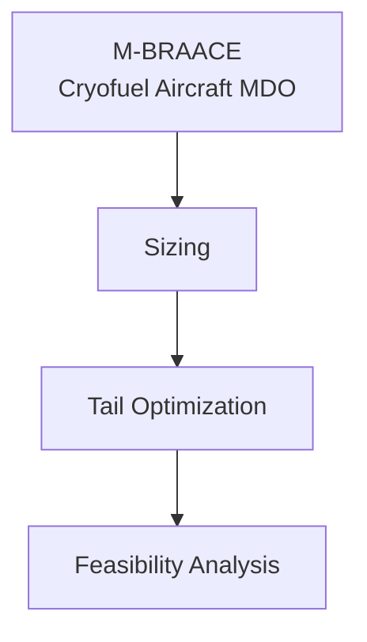
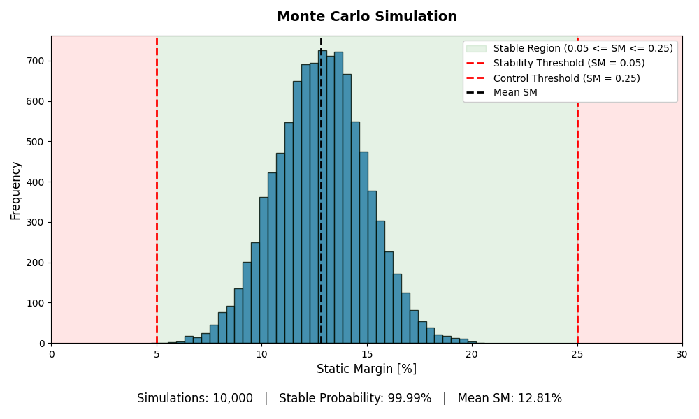

# M-BRAACE

**Michigan – Boeing Research in Aircraft Architecture for Cryofuel Efficiency**

A multidisciplinary design optimization (MDO) framework for a cryogenically-fueled aircraft concept. Developed at the University of Michigan as part of the M-BRAACE MBSE design project; results presented at Boeing design reviews.

## Framework

## Modules

| Directory | Purpose |
|---|---|
| `Aircraft_Sizeopt/` | Conceptual sizing — weight buildup, fuel fraction, mission profile |
| `Aircraft_Tailopt/` | T-tail MDO via `pyoptsparse` / SLSQP — 5 design variables, 17 constraints (boom deflection, spar stress, von Mises yield, torsional rigidity) |
| `montecarlo/` | Monte Carlo sampling over aero & structural uncertainty to characterize feasibility margins |

Per-module results and plots live inside each directory.

## Sample Result

  

Distribution of static stability margin across Monte Carlo samples, used to identify the driving constraints in the feasibility envelope and analyze performance of the resulting tail design.

## Context

Year 1 of M-BRAACE (2025–26), University of Michigan · Sponsored research with Boeing · Code shared as portfolio reference; not actively maintained.

**Author:** Jared Tuatini — Aerospace Engineering & Computer Science, University of Michigan