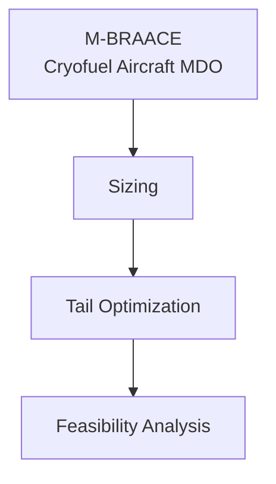

# M-BRAACE

**Michigan – Boeing Research in Aircraft Architecture for Cryofuel Efficiency**

A multidisciplinary design optimization (MDO) framework for a cryogenically-fueled aircraft concept. Developed at the University of Michigan as part of the M-BRAACE MBSE design project; results presented at Boeing design reviews.

## Framework

## Modules

| Directory | Purpose |
|---|---|
| `Aircraft_Sizeopt/` | Conceptual sizing — weight buildup, fuel fraction, mission profile |
| `Aircraft_Tailopt/` | T-tail MDO via `pyoptsparse` / SLSQP — 5 design variables, 17 constraints (boom deflection, spar stress, von Mises yield, torsional rigidity) |
| `montecarlo/` | Monte Carlo sampling over aero & structural uncertainty to characterize feasibility margins |

Per-module results and plots live inside each directory.

## Sample Result

  

Distribution of static stability margin across Monte Carlo samples, used to identify the driving constraints in the feasibility envelope and analyze performance of the resulting tail design.

## Converged Design Point

T-tail optimization converged to a near-feasible design with **16/18 constraints strictly satisfied**. The two reported violations are characterized below.

| Configuration | Value |
|---|---|
| TOGW | 27.2 kg |
| Wing span | 5.02 m |
| Wing area | 3.15 m² |
| Cruise speed | 13.0 m/s |
| Static margin | 13.9% |

| Optimal Design Variable | Value |
|---|---|
| Boom length | 1.68 m |
| H-tail area | 0.446 m² |
| V-tail area | 0.241 m² |
| H-tail taper ratio | 0.69 |
| V-tail taper ratio | 0.60 |

**Tail weight:** 2.78 kg (10.2% of TOGW) · **Total drag:** 1.51 N

### Constraint violations

- **`incidence_max` (margin −0.041):** caused by an error in the incidence-angle constraint formulation; corrected in post-processing (revised H-tail AoA of −2.0° satisfies the constraint).
- **`yaw_control` (margin −6e-6):** out of scope for this iteration; violation is within numerical noise of the constraint solver.

Full report: [`Aircraft_Tailopt/output/final_optimization_summary.txt`](Aircraft_Tailopt/output/final_optimization_summary.txt)

## Context

Year 1 of M-BRAACE (2025–26), University of Michigan · Sponsored research with Boeing · Code shared as portfolio reference; not actively maintained.

**Author:** Jared Tuatini — Aerospace Engineering & Computer Science, University of Michigan

> **Note:** This repository is a snapshot of the design framework as of the final review. It is not packaged for general use — dependencies and entry points are not pinned, and reproducibility is not guaranteed.